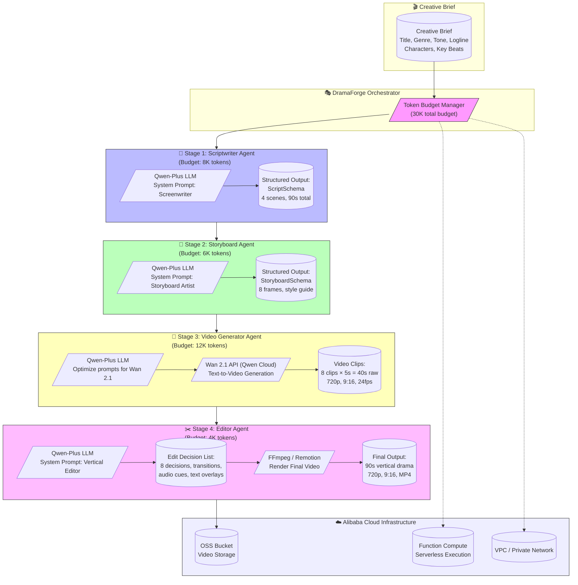
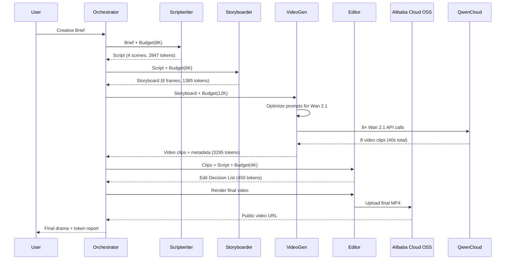

# DramaForge Architecture

## System Overview



## Data Flow



## Token Budget Allocation

| Stage | Budget | Typical Usage | Purpose |
|-------|--------|---------------|---------|
| Scriptwriting | 8,000 | ~2,800 | Creative writing, character voices |
| Storyboarding | 6,000 | ~1,400 | Frame breakdown, camera directions |
| Video Generation | 12,000 | ~3,300 | Wan 2.1 prompt optimization + generation |
| Editing | 4,000 | ~450 | EDL creation, pacing decisions |
| **Total** | **30,000** | **~8,000** | **22K buffer for iterations** |

## Key Innovations

### 1. Token-Aware Pipeline
- Each agent receives explicit token budget
- Orchestrator tracks cumulative usage
- Automatic budget enforcement with graceful degradation

### 2. Character Consistency System
- Character profiles persisted across all stages
- Visual descriptors injected into storyboard & video prompts
- Negative prompts prevent drift

### 3. Vertical-First Cinematography
- 9:16 aspect ratio enforced at every stage
- Camera vocabulary optimized for mobile viewing
- Fast-cut pacing (2-3s average shot length)

### 4. Production-Ready Output
- Structured schemas (Zod) for type safety
- Edit Decision List compatible with FFmpeg/Remotion
- Alibaba Cloud OSS integration for delivery

## Deployment Architecture

```mermaid
flowchart LR
    subgraph Local["💻 Local Development"]
        Dev[Node.js App\nDramaForge]
    end

    subgraph Cloud["☁️ Alibaba Cloud"]
        FC[Function Compute\n(Serverless Agents)]
        OSS[OSS Bucket\nVideo Assets]
        Dash[DashScope API\nQwen Models]
        VPC[VPC Network]
    end

    Dev -->|Deploy| FC
    FC -->|API Calls| Dash
    FC -->|Store Videos| OSS
    FC -.->|Private Access| VPC
    OSS -->|CDN Delivery| User((👤 Viewer))
```

## Running the Demo

```bash
# Install dependencies
npm install

# Configure API key (get from Qwen Cloud)
cp .env.example .env
# Edit .env with your QWEN_API_KEY

# Run demo (mock mode works without API key)
node demo.js

# Run with real API (requires Qwen Cloud credits)
# Set QWEN_API_KEY in .env
node demo.js
```

## Project Structure

```
DramaForge/
├── agents/
│   ├── BaseAgent.js           # Shared LLM client + mock mode
│   ├── ScriptwriterAgent.js   # Stage 1: Creative writing
│   ├── StoryboardAgent.js     # Stage 2: Frame breakdown
│   ├── VideoGeneratorAgent.js # Stage 3: Wan 2.1 prompts + gen
│   ├── EditorAgent.js         # Stage 4: EDL + rendering
│   └── DramaForgeOrchestrator.js  # Pipeline coordinator
├── config/
│   └── qwen.js                # Model config, token budgets
├── src/
│   └── schemas.js             # Zod schemas for all stages
├── demo.js                    # Demo script
├── .env.example               # Config template
└── package.json
```

## Submission Checklist (Track 2: AI Showrunner)

- [x] **Architecture Diagram** - Mermaid diagrams above
- [x] **Core Pipeline** - 4-agent orchestrated workflow
- [x] **Token Budget Management** - 30K total with per-stage limits
- [x] **Character Consistency** - Profiles persist across stages
- [x] **Vertical Video Format** - 9:16, 720p, fast-paced editing
- [x] **Wan 2.1 Integration** - Optimized prompts for text-to-video
- [x] **Demo Output** - 90s sci-fi drama "The Last Message"
- [ ] **Alibaba Cloud Deployment** - Function Compute + OSS
- [ ] **3-min Demo Video** - Screen recording of pipeline
- [ ] **Public GitHub Repo** - MIT license, all source code
- [ ] **Devpost Submission** - Before Jul 20, 2026 deadline